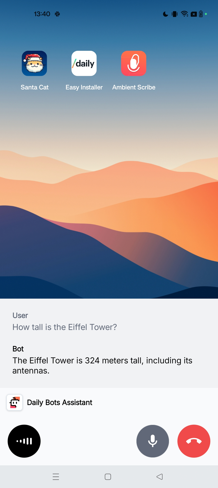

# 🤖 Daily Bots Assistant Demo

An Android voice assistant using the Daily Bots API.

Features include:

* Trigger by long-pressing the home button
* Uses GPT-4o
* Useful abilities integrated using tool calling:
  * 📅 List calendar events ("what appointments do I have today?")
  * 🧠 Store and recall information ("where did I park my car?")
  * 💻 Write and run Lua code ("what's the 1000th prime number?")
  * 👋 Close the chat at the appropriate time ("that's everything, thank you!")
* Displayed as an overlay at the bottom of the screen

## Prerequisites

To run the app you will need a [Daily Bots account](https://bots.daily.co/sign-up) and an [OpenAI API key](https://openai.com/).

## Screenshot

